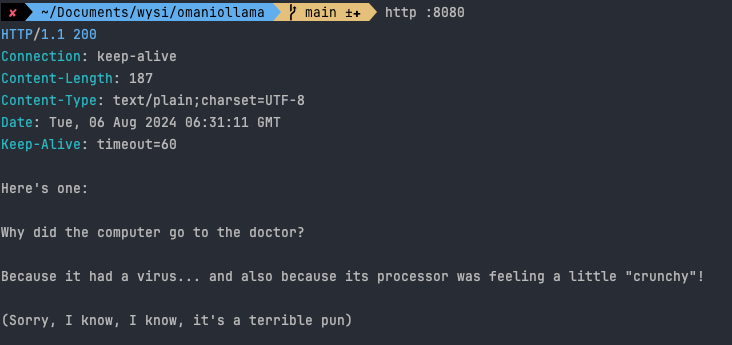

## Ollama

1. 如果你想要使用 private LLM，不想把私人資料分享給公開的 GPT, Gemini, OpenAI
2. 呼叫公開的 LLM 很花錢

## Steps

1. 安裝 ollama 3.1

```
ollama run llama3.1:8b
```
Note: 有料的 web ui

https://github.com/open-webui/open-webui

2. 建立 springboot project


3. 更改 LLM provider 的預設版本
   - `<spring-ai.version>1.0.0-M1</spring-ai.version>` 改成 SNAPSHOT
   - repository 要加入 spring snapshots
   
4. Spring documentation 文件說預設的 supported model 是 mistral
   - 把它改成 llama3.1
   
Note: 安裝 [Spring Explyt](https://plugins.jetbrains.com/plugin/23273-spring-explyt/versions/stable) 會給你 application properties 提示，太讚

5. 建立 ChatController，注入 `ChatClient.Builder`
   ```java
   @GetMapping("/**")
   public String joke() {
       return chatClient.prompt().user("Please tell me a bad joke about computers")
           .call()
           .content();
   }
   ```
6. 使用 httPie 測試，在 terminal 輸入 `http :8080`，如下結果
   

7. 